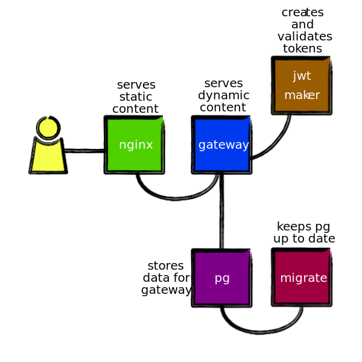

# Invoicify: _A Professional Development App_

This is the **microservices** branch of the Invoicify application. In it, you
will find a microservice-based implementation of the Invoicify app.

The application consists of five services:

* **gateway**: The service that manages invoices, clients, and people.
* **jwt-maker**: The service that manages the secret for the application, and
  creates and verifies tokens used by other services.
* **nginx**: The web server that serves static resources and proxies calls to
  *gateway*.
* **pg**: The PostgreSQL database that manages the persistence of the data.
* **pg/migrate**: A migration service that makes sure the database is
  structurally up-to-date.



## Specifics

This application will initialize the PostgreSQL data repository into the
_pg/data_ directory.

The **migrate** service is expected to exit with return code 0. It makes sure
the database is in the correct state at all times. If you add another migration
to _pg/schema/migrations_, you can just run the **migrate** service, again, to
apply the new migration.

All static assets of the system, CSS, images, and the like, are in the
_nginx/static_ directory which is served by an NGINX Web server.

## Prerequisites

To run this application, you will need to install the following software.

* [Docker](https://www.docker.com/) for your specific operating system

To change the implementation of the Node-based services, you'll want to use
the following version of Node.

* Node.js v15+

There is an _.nvmrc_ file that you can use by typing `nvm use` in the root
directory of the repository which will use any version 15 of Node.js you have
installed with **nvm**.

## Running the application

You can run the application after cloning this repository and checking out the
**microservice** branch. Then, you will use the `docker-compose` command line
to build and start up the application.

```sh
docker-compose -f docker-compose-development.yml --env-file .env.dev build
docker-compose -f docker-compose-development.yml --env-file .env.dev up
```

Then, you can open the application at http://localhost:8910.

If it takes Docker Compose more than 60 seconds to start some services on your
computer, you may need to increase the value of `WAIT_HOSTS_TIMEOUT` in the
_docker-compose-development.yml_ file. Both the **migrate** and **gateway**
services use this mechanism to start only after their dependent services are
"properly" started, that is, responding on appropriate ports.

**Note**: The migrate service runs at startup, checks to see if the database is
up to date with migrations, and then quits. It is not a long-running service.

## Clean up

You can remove the container with the following command.

```sh
docker-compose -f docker-compose-development.yml --env-file .env.dev rm -f
```

Then, you can remove the containers generated from this directory with the following command.

```sh
for image in `docker image ls | grep "$(basename $(pwd))_" | awk -s '{ print $1; }'`
do
  docker image rm $image
done
```

Finally, if you want to clean up the data from PostgreSQL, run this command.

```sh
rm -rf ./pg/data
```
